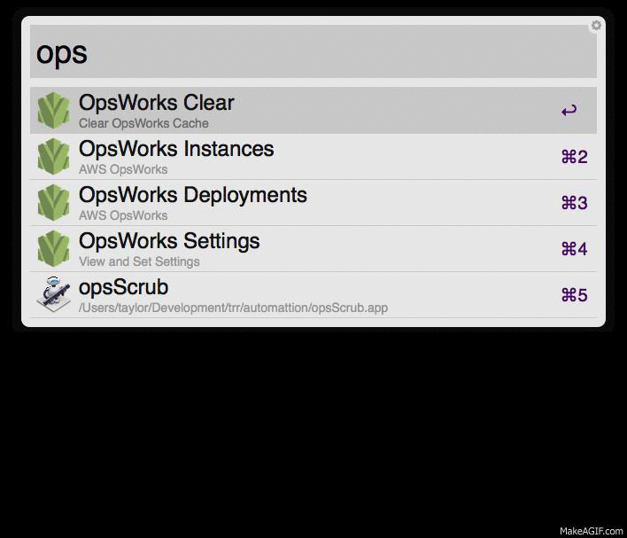

Alfred AWS OpsWorks Workflow
----------------------------

## Requirements
- [AWS CLI](http://aws.amazon.com/cli/)

## Commands
### ops instances
First displays all stacks, after selecting all instances within stack are showing
- <kbd>Enter</kbd>: ssh into instance (uses private IP(VPC) if no external IP exists)
- <kbd>Command</kbd> + <kbd>Enter</kbd>: Copy and paste the IP
- <kbd>Shift</kbd> + <kbd>Enter</kbd>: Opens the IP in a browser

### ops deployments
First displays all stacks, after selecting all deployments for the stack are shown
- <kbd>Enter</kbd>: Drill down into deployments for each log
- <kbd>Shift</kbd> + <kbd>Enter</kbd>: Show deployment JSON in large text

### ops commands {deployment-id}
Displays information about deployment commands per instance.  Best to drill down into this from `ops deployments`
- <kbd>Enter</kbd>: Opens the deployment log file in your browser
- <kbd>Shift</kbd> + <kbd>Enter</kbd>: Show command JSON in large text

### ops settings
Options for viewing and changing the settings

- ops settings aws_path: Change the CLI location. Default /usr/local/bin/aws
- ops settings profile: The AWS CLI profile to use. Default default
- ops settings cache_length: Seconds before invaliding cache. Default 30

### ops clear
clears the cache for forced refresh of data.  Cache is used by default so real time filtering can be used without performing an AWS call on every keystroke

## Future Features
- Settings for passing SSH options
- Re-run a deployment
- Open to OpsWork console for instances and deployments
- ???
